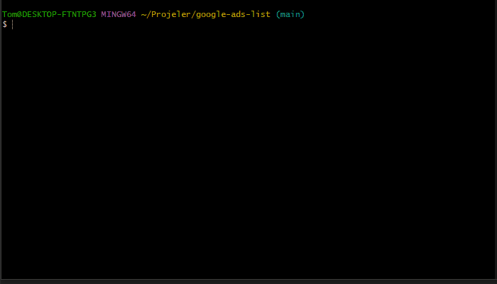

# Google ADS List | Puppeteer
With this project, you can get the list of ads appearing in google.com search results.

You can write the words you want by editing the `settings.json` settings file.

Puppeteer browser automation was used in this project.

## Demo

  
   

## Instructions

1. Clone locally using `git clone git@github.com:CanKorkmazim/google-ads-list.git`
2. Install dependencies using `npm install`
3. Check `settings.json` and edit it as it suits you.
4. Start your app using `npm run start`

> [!NOTE]
> Please check the [requirements](https://pptr.dev/guides/system-requirements) for the **Puppeteer library.

## Features
Here is the full features list:

- Multiple word support
- Adjustable waiting times
- Configurable browser user-agent
- Adjustable CSS selectors
- Creates a JSON file for each word search

By [Can Korkmaz](https://github.com/CanKorkmazim)